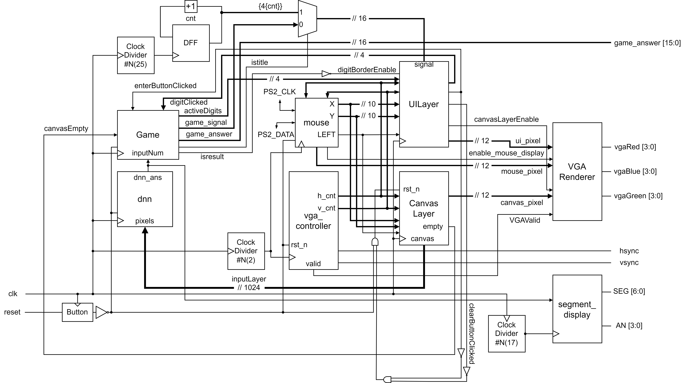

# Handwritten Chinese Numerals Recognition: 1A2B Game

A handwritten recognizer for Chinese numerals implementation on Basys 3 Artix-7 FPGA using verilog and SystemVerilog.

## Report & Explanation

See [report.pdf](report.pdf) for detail information.

## Source

Check [verilog](verilog) folder.

